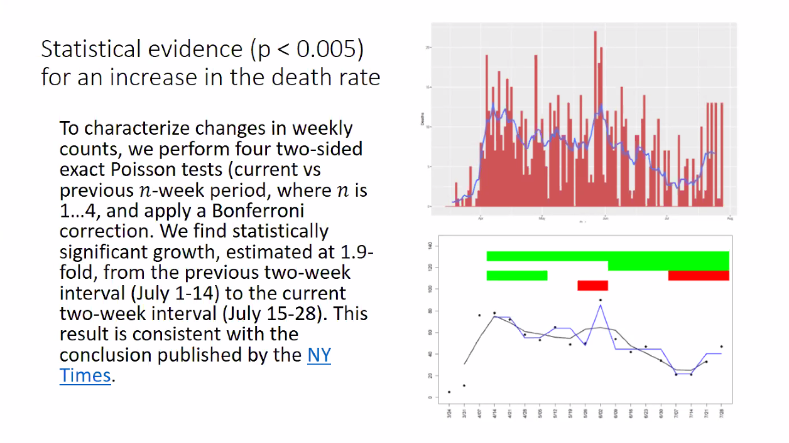

```{r setup, include=FALSE}
library(knitr)
library(readr)
library(tidyverse)
library(lubridate)
library(utils)
library(httr)


opts_chunk$set(echo = TRUE)
source("helper_check_hyp_test.R")
```

```{r get_data, echo=FALSE, message=FALSE}

data_file_state   <- paste0('data/us_state_data_', as.character(Sys.Date()), '.csv')

if (!file.exists(data_file_state)) {
  response_state <- try(httr::GET(url = 'https://raw.githubusercontent.com/nytimes/covid-19-data/master/us-states.csv',
                                  authenticate(':', ':', type='ntlm'),
                                  config(timeout = 20),
                                  write_disk(data_file_state, overwrite = TRUE)))
}

if (file.exists(data_file_state)) {
  df_state <- read_csv(data_file_state)
  #problems opening the NYT connection 4/4/2020.  Also, native date format is %Y-%m-%d  Manual file manip changes date format.
  df_state$date <- as.Date(df_state$date,format='%m/%d/%Y')
  state_names <- unique(df_state$state)
  #rename state variable to countriesAndTerritories to keep code consistent with nations data set
 
  colnames(df_state) <- c('dateRep', 'countriesAndTerritories', 'fips', 'cum_cases', 'cum_deaths')
  df_state$fips <- NULL

}


df_state <- df_state %>%group_by(countriesAndTerritories) %>% 
    mutate(deaths=make_vec(cum_deaths)) %>%
    mutate(cases= make_vec(cum_cases))

 

df_WI <- df_state %>% 
            filter(countriesAndTerritories == "Wisconsin",
                   dateRep <= as.Date("2020-07-27"))
            

names(df_WI)[1:2] <- c("Date_reported", "NAME")

#find date of first death by observation

df_WI <- df_WI %>% filter(Date_reported >= as.Date("2020-03-19"))


cut_date <- max(df_WI$Date_reported) - 14
date_calc_end <- cut_date 
date_calc_start <- cut_date - 29

#Check day of week effect


df_WI$wday <- wday(df_WI$Date_reported, label=TRUE)

table_out <- as.data.frame(do.call(rbind,by(df_WI$deaths,df_WI$wday,summary)))

table_out$Mean <- round(table_out$Mean,2)

kable(table_out, caption=paste0("Summary of Deaths, from ",min(df_WI$Date_reported)," to ", max(df_WI$Date_reported)))

```

## Background

I wanted to compare the multiple hypothesis testing method to control chart approach: are the most recent 7 day series of deaths in Wisconsin 'up' or 'down'?

Jeff Bond's hypothesis testing approach says the most recent week's deaths are higher than previous weeks.

The control chart approach also says the most recent week differs from previous lower deaths in previous weeks.

I set up the code to investigate performance of the two approaches, I may do more this weekend.


### Testing for differences

Jeff Bond presented a set of hypothesis tests on 28 July:  Are recent week(s) in the Wisconsin Covid death series higher than previous weeks?  I think I have reproduced the test procedure.



To account for multiple tests, use the Bonferroni approach.  

In the set of exact two sided-tests Poisson tests comparing the most recent N weeks to the previous N weeks in the death series, for N = 1, 2, 4, and 8, calculate:


```{r  testing}
df_test <- daily_to_weekly(df_WI) %>% 
                  filter(!is.na(week_num)) %>% 
                  rename(Date_reported = week_end)

#test 1:  Current week to previous week
test1 <- poisson.test(x=c(df_test$deaths[1],df_test$deaths[2]), T = 1)

test1B <- binom.test(x=50,n=77,p=0.5, alternative="two.sided")

test1

test1B

#test 2:  Most recent two weeks to previous 2 weeks
test2 <- poisson.test(x=c(sum(df_test$deaths[1:2]),
                         sum(df_test$deaths[3:4])), T = c(1,1))

#test4:  4 weeks to 4 weeks
test4 <- poisson.test(x=c(sum(df_test$deaths[1:4]),
                          sum(df_test$deaths[5:8])), T = c(4,4))

#test8:  8 weeks to 8 weeks
test8 <- poisson.test(x=c(sum(df_test$deaths[1:8]),
                          sum(df_test$deaths[9:16])), T = c(8,8))

table_out <- data.frame(c(1,2,4,8),
                        round(c(test1$p.value, 
                                           test2$p.value,test4$p.value,test8$p.value),4),
                        round(c(test1$estimate,test2$estimate,test4$estimate,test8$estimate),2),
                        c(test1$statistic,test2$statistic,test4$statistic,test8$statistic))

names(table_out) <- c("weeks used","p-value","ratio of counts", "numerator of ratio")

kable(table_out)


```

Jeff's slide says "statistical evidence (p < .005) for an increase in the death rate" which suggests p-value less than 0.00125.   Line 2 in the table is close to that level rejecting the hypothesis of equality at 0.0017, a nominal level of .0068.   Should the quoted p value be "p < .01"?  

\newpage

## Control Chart Approach

Deaths taken from NYTimes thru 7/27: <https://raw.githubusercontent.com/nytimes/covid-19-data/master/us-states.csv>

Using 7 day buckets per Carl F's code in June.


### Initial plots:  daily data, in run chart format

Plot of daily deaths:  baseline median is 30 days before the last 14 days

Plot of weekly deaths(1):  baseline median is 5 weeks before the last two weeks

Plot of weekly deaths(2):  baseline median is entire series before the last two weeks

```{r plots_1, echo=FALSE, results = 'hide', warning = FALSE, message = FALSE, fig.keep='all',fig.height=4, fig.width=9}


p_daily_deaths <- count_plot(dfx=df_WI,location="Wisconsin",date_calc_end=date_calc_end,date_calc_start=date_calc_start,agg_weekly=FALSE)

p_daily_deaths


p_weekly_deaths1 <- count_plot(dfx=df_WI,location="Wisconsin",date_calc_end=date_calc_end,date_calc_start=date_calc_start,agg_weekly=TRUE)

p_weekly_deaths1

p_weekly_deaths2 <- count_plot(dfx=df_WI,location="Wisconsin",date_calc_end=date_calc_end,date_calc_start=min(df_WI$Date_reported),agg_weekly=TRUE)

p_weekly_deaths2

p_weekly_deaths3 <- count_plot(dfx=df_WI,location="Wisconsin",date_calc_end=date_calc_end+7,date_calc_start=min(df_WI$Date_reported),agg_weekly=TRUE)

start_date <- as.Date("2020-07-15")

end_date <- as.Date("2020-07-25")

y_start <- 59

y_end <- 51

p_weekly_deaths3 + annotate("text",x=as.Date("2020-07-15"),y=62,label="Deaths week ending 27 July") + annotate("segment", x = start_date, xend = end_date, y = y_start, yend = y_end, size=0.5, arrow=arrow(length=unit(0.1, "inches")))
```

\newpage

### Control chart views

Control chart calculations require specification of a baseline period to calculate preliminary limits.   If we cannot specify a baseline period, then we cannot construct a chart.  We don't require a state of statistical control to get started; we start with the data and construct one or more charts and study the structure.

The baseline period here is set as all weeks up to but not including the most recent 7 day period (blue dot).

The Shewhart charts (c-chart and i-chart) help the user contrast short-term and long-term variation. Short and long are relative to the specific series.  Are there any signals of special cause? 

In practice, signals of special cause on investigation are often a confounded mix of measurement and system issues.

There is clearly structure in the time series:  the charts show signals of lower deaths in early July, culmination of a drift downward in deaths over the spring.   The last week in the series is higher than the death counts below the lower control limits.

The inability of the control chart approach to present a precise significance level or a probability statement is a feature, not a bug. 

On the assumption of Poisson variation, there is no need to look at counts week by week:  we use the fact that a sum of independent Poisson variables with means $\lambda_{i}$ is distributed as Poisson with mean $\sum_{i=1}^{N} \lambda_{i}$.   However, use of the Poisson fact implies that there is no information about the system that might be revealed by considering the counts in the order in which they appear.   

("Presentation of results, to be optimally useful, and to be good science, must conform to Shewhart's rule: viz., preserve, for the uses intended, all the evidence in the original data." (W.E. Deming, "On probability as a basis for action", American Statistician, 29, No. 4., 148)).

### Interpretation of Shewhart charts

c-chart:   the variation in weekly deaths is not adequately described as Poisson with a common mean 50. Seven points outside control limits, 11 consecutive points at or above the weekly average.

i-chart:   the variation in weekly deaths based on week to week changes shows three points beyond the control limits. 

The limits are 41% wider relative to Poisson variation, an indication of over-dispersion derived from week to week variation.

The charts show that week(s) in early July have lower deaths relative to the rest of the history; other than the deaths in the first week in June, the pattern is generally decreasing through early July. The last week in the series is clearly different, higher than than previous weeks.

While the data do not allow a simple description of the death series--the death series is not in a state of simple statistical control--early July death counts are unusually low and the most recent week is higher.  

Note on Laney chart (not shown):  the 'area of opportunity' for weekly counts is uniform across the series so the Laney chart here is identical to the i-chart.  This situation contrasts with the Laney chart applied to percent positive cases, where the denominator changes week to week and the control limits are interpolated between the binomial limits and the individual chart limits. 


```{r control_charts, fig.height= 4, fig.width=9, echo=FALSE, warning = FALSE, message = FALSE, results = 'hide', fig.keep='all'}
agg_weekly <- TRUE

dfx <- df_WI

if(agg_weekly) {
        dfx <- daily_to_weekly(dfx) %>% 
                  filter(!is.na(week_num)) %>% 
                  rename(Date_reported = week_end)
}

#Now make control charts based on the aggregated death counts
baseline_end <- as.Date("2020-07-20")

baseline_start <- as.Date("2020-03-30")

title1 <- "c-chart for deaths: "

subtitle1 <- paste0("Limits based on Poisson variation, baseline through ", baseline_end)

ccharts <- plot_ccharts(df1=dfx, 
                        region_name= "Wisconsin", 
                        date_calc_end = as.Date("2020-07-20"),
                        date_calc_start = as.Date("2020-03-30"),
                        title = title1,
                        subtitle = subtitle1)

ccharts$cchart
title2 <- "Individuals control chart for deaths: "

subtitle2 <- "Limits based between weekly variation, using median moving range "

icharts <- plot_icharts(df1=dfx, 
                        region_name= "Wisconsin",
                        date_calc_end = as.Date("2020-07-20"),
                        date_calc_start = as.Date("2020-03-30"),
                        title = title2,
                        subtitle = subtitle2)

icharts$ichart


```


```{r short_series, echo=FALSE}
#Now make control charts based on the aggregated death counts
baseline_end <- as.Date("2020-06-29")

baseline_start <- as.Date("2020-04-06")

title3 <- 

subtitle3 <- paste0(subtitle1, "baseline: open circles")

ccharts <- plot_ccharts(df1=dfx, 
                        region_name= "Wisconsin", 
                        date_calc_end = baseline_end,
                        date_calc_start = baseline_start,
                        title = ,
                        subtitle = subtitle3)

#ccharts$cchart

subtitle4 <- paste0(subtitle2, "baseline: open circles")

icharts <- plot_icharts(df1=dfx, 
                        region_name= "Wisconsin",
                        date_calc_end = baseline_end,
                        date_calc_start = baseline_start,
                        title = title2,
                        subtitle = subtitle4)

#icharts$ichart


```


$\overline{c} \pm 3\sqrt{\overline{c}}$

